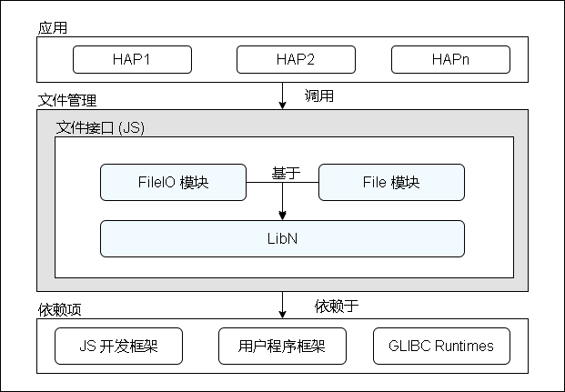

# 文件访问接口<a name="ZH-CN_TOPIC_0000001101541814"></a>

-   [简介](#section104mcpsimp)
    -   [系统架构](#section110mcpsimp)

-   [目录](#section113mcpsimp)
-   [约束](#section117mcpsimp)
-   [说明](#section125mcpsimp)
    -   [接口说明](#section127mcpsimp)
    -   [使用说明](#section149mcpsimp)

-   [相关仓](#section178mcpsimp)

## 简介<a name="section104mcpsimp"></a>

文件访问接口提供基础文件IO操作能力，其具体包括用于管理文件的基本文件接口，管理目录的基本目录接口，获取文件信息的统计接口，流式读写文件的流式接口，以及文件锁接口。

### 系统架构<a name="section110mcpsimp"></a>

文件访问接口仅面向应用程序提供应用文件访问能力，其由ohos.file.fs模块、ohos.file.statvfs模块、ohos.file.hash模块、ohos.file.securityLabel模块和ohos.file.environment模块组成。架构上，文件访问接口实现了自研的 LibN，其抽象了 NAPI 层接口，向文件访问接口提供包括基本类型系统、内存管理、通用编程模型在内的基本能力。

**图 1**  文件访问接口架构图<a name="fig174088216114"></a>  


## 目录<a name="section113mcpsimp"></a>

```
foundation/filemanagement/file_api
├── figures                     # 仓库图床
├── interfaces                  # 接口代码
├    └── kits                   # 对外接口代码
├── utils                       # 公共组件
├    └── filemgmt_libhilog      # 日志组件
├    └── filemgmt_libn          # 平台相关组件
```

## 约束<a name="section117mcpsimp"></a>

本地 IO 接口

-   目前仅支持 UTF-8/16 编码；
-   目前 URI 暂不支持外部存储目录；

## 说明<a name="section125mcpsimp"></a>

### 接口说明<a name="section127mcpsimp"></a>

当前文件访问接口开放本地文件目录访问接口，按照功能，其可划分为如下几种类型：

**表 1**  接口类型表

<a name="table99228171027"></a>
<table><thead align="left"><tr id="row2092221715211"><th class="cellrowborder" valign="top" width="15.02%" id="mcps1.2.5.1.1"><p id="p79225171524"><a name="p79225171524"></a><a name="p79225171524"></a>接口类型</p>
</th>
<th class="cellrowborder" valign="top" width="32.25%" id="mcps1.2.5.1.2"><p id="p992271711216"><a name="p992271711216"></a><a name="p992271711216"></a>接口用途</p>
</th>
<th class="cellrowborder" valign="top" width="25.840000000000003%" id="mcps1.2.5.1.3"><p id="p29225175213"><a name="p29225175213"></a><a name="p29225175213"></a>相关模块</p>
</th>
<th class="cellrowborder" valign="top" width="26.889999999999997%" id="mcps1.2.5.1.4"><p id="p129221017720"><a name="p129221017720"></a><a name="p129221017720"></a>接口示例（类名.方法名）</p>
</th>
</tr>
</thead>
<tbody><tr id="row149231717327"><td class="cellrowborder" valign="top" width="15.02%" headers="mcps1.2.5.1.1 "><p id="p3923417629"><a name="p3923417629"></a><a name="p3923417629"></a>基本文件接口</p>
</td>
<td class="cellrowborder" valign="top" width="32.25%" headers="mcps1.2.5.1.2 "><p id="p89236171124"><a name="p89236171124"></a><a name="p89236171124"></a>需要用户提供沙箱路径或文件描述符（fd），提供创建、修改及访问文件的能力</p>
</td>
<td class="cellrowborder" valign="top" width="25.840000000000003%" headers="mcps1.2.5.1.3 "><p id="p22011844349"><a name="p22011844349"></a><a name="p22011844349"></a>@ohos.file.fs</p>
</td>
<td class="cellrowborder" valign="top" width="26.889999999999997%" headers="mcps1.2.5.1.4 "><p id="p1784383174320"><a name="p1784383174320"></a><a name="p1784383174320"></a>accessSync</p>
<p id="p184313310437"><a name="p184313310437"></a><a name="p184313310437"></a>access</p>
<p id="p1684318315436"><a name="p1684318315436"></a><a name="p1684318315436"></a>openSync</p>
<p id="p0390135216324"><a name="p0390135216324"></a><a name="p0390135216324"></a>open</p>
<p id="p202016525456"><a name="p202016525456"></a><a name="p202016525456"></a>moveFileSync</p>
<p id="p8142558194520"><a name="p8142558194520"></a><a name="p8142558194520"></a>moveFile</p>
</td>
</tr>
<tr id="row1692320171825"><td class="cellrowborder" valign="top" width="15.02%" headers="mcps1.2.5.1.1 "><p id="p392391710219"><a name="p392391710219"></a><a name="p392391710219"></a>获取目录项</p>
</td>
<td class="cellrowborder" valign="top" width="32.25%" headers="mcps1.2.5.1.2 "><p id="p109232176211"><a name="p109232176211"></a><a name="p109232176211"></a>需要用户提供沙箱路径，提供读取目录及过滤目录文件的能力</p>
</td>
<td class="cellrowborder" valign="top" width="25.840000000000003%" headers="mcps1.2.5.1.3 "><p id="p271274219410"><a name="p271274219410"></a><a name="p271274219410"></a>@ohos.file.fs</p>
</td>
<td class="cellrowborder" valign="top" width="26.889999999999997%" headers="mcps1.2.5.1.4 "><p id="p29233177216"><a name="p29233177216"></a><a name="p29233177216"></a>listFileSync</p>
<p id="p29333177216"><a name="p29333177216"></a><a name="p29333177216"></a>listFile</p>
</td>
</tr>
<tr id="row14923171716217"><td class="cellrowborder" valign="top" width="15.02%" headers="mcps1.2.5.1.1 "><p id="p159234176215"><a name="p159234176215"></a><a name="p159234176215"></a>获取文件信息接口</p>
</td>
<td class="cellrowborder" valign="top" width="32.25%" headers="mcps1.2.5.1.2 "><p id="p1992314179215"><a name="p1992314179215"></a><a name="p1992314179215"></a>需要用户提供沙箱路径，提供包括文件大小、访问权限、修改时间在内的基本统计信息</p>
</td>
<td class="cellrowborder" valign="top" width="25.840000000000003%" headers="mcps1.2.5.1.3 "><p id="p325774111413"><a name="p325774111413"></a><a name="p325774111413"></a>@ohos.file.fs</p>
</td>
<td class="cellrowborder" valign="top" width="26.889999999999997%" headers="mcps1.2.5.1.4 "><p id="p59231317420"><a name="p59231317420"></a><a name="p59231317420"></a>statSync</p>
<p id="p57231317420"><a name="p57231317420"></a><a name="p57231317420"></a>stat</p>
</td>
</tr>
<tr id="row692319171228"><td class="cellrowborder" valign="top" width="15.02%" headers="mcps1.2.5.1.1 "><p id="p1592318171526"><a name="p1592318171526"></a><a name="p1592318171526"></a>流接口</p>
</td>
<td class="cellrowborder" valign="top" width="32.25%" headers="mcps1.2.5.1.2 "><p id="p992311171421"><a name="p992311171421"></a><a name="p992311171421"></a>需要用户提供沙箱路径或文件描述符，提供流式读写文件的能力</p>
</td>
<td class="cellrowborder" valign="top" width="25.840000000000003%" headers="mcps1.2.5.1.3 "><p id="p1692321716217"><a name="p1692321716217"></a><a name="p1692321716217"></a>@ohos.file.fs</p>
</td>
<td class="cellrowborder" valign="top" width="26.889999999999997%" headers="mcps1.2.5.1.4 "><p id="p10923141711215"><a name="p10923141711215"></a><a name="p10923141711215"></a>createStreamSync</p>
<p id="p88031126184311"><a name="p88031126184311"></a><a name="p88031126184311"></a>createStream</p>
<p id="p14923141711215"><a name="p14923141711215"></a><a name="p14923141711215"></a>fdopenStreamSync</p>
<p id="p84031126184311"><a name="p84031126184311"></a><a name="p84031126184311"></a>fdopenStream</p>
</td>
</tr>
<tr id="row92319171228"><td class="cellrowborder" valign="top" width="15.02%" headers="mcps1.2.5.1.1 "><p id="p1592418171526"><a name="p1592418171526"></a><a name="p1592418171526"></a>文件锁接口</p>
</td>
<td class="cellrowborder" valign="top" width="32.25%" headers="mcps1.2.5.1.2 "><p id="p992411171421"><a name="p992411171421"></a><a name="p992411171421"></a>提供文件阻塞式、非阻塞式施加共享锁或独占锁，及解锁的能力</p>
</td>
<td class="cellrowborder" valign="top" width="25.840000000000003%" headers="mcps1.2.5.1.3 "><p id="p1692421716217"><a name="p1692421716217"></a><a name="p1692421716217"></a>@ohos.file.fs</p>
</td>
<td class="cellrowborder" valign="top" width="26.889999999999997%" headers="mcps1.2.5.1.4 "><p id="p10924141711215"><a name="p10924141711215"></a><a name="p10924141711215"></a>lock</p>
<p id="p88031226184311"><a name="p88031226184311"></a><a name="p88031226184311"></a>tryLock</p>
<p id="p88031326184311"><a name="p88031326184311"></a><a name="p88031326184311"></a>unlock</p>
</td>
</tr>
</tbody>
</table>

open接口可以指定mode参数以打开相应功能权限，说明如下：

**表 2**  OpenMode类型表

| 名称   | 类型   | 值  | 说明      |
| ---- | ------ |---- | ------- |
| READ_ONLY | number |  0o0   | 只读打开。 |
| WRITE_ONLY | number | 0o1    | 只写打开。 |
| READ_WRITE | number | 0o2    | 读写打开。 |
| CREATE | number | 0o100    | 若文件不存在，则创建文件。 |
| TRUNC | number | 0o1000    | 如果文件存在且以只写或读写的方式打开文件，则将其长度裁剪为零。 |
| APPEND | number | 0o2000   | 以追加方式打开，后续写将追加到文件末尾。 |
| NONBLOCK | number | 0o4000    | 如果path指向FIFO、块特殊文件或字符特殊文件，则本次打开及后续 IO 进行非阻塞操作。 |
| DIR | number | 0o200000    | 如果path不指向目录，则出错。 |
| NOFOLLOW | number | 0o400000    | 如果path指向符号链接，则出错。 |
| SYNC | number | 0o4010000    | 以同步IO的方式打开文件。 |

文件过滤配置项类型，支持listFile接口使用，说明如下：

**表 3**  Filter

| 名称        | 类型       | 说明                |
| ----------- | --------------- | ------------------ |
| suffix | Array&lt;string&gt;     | 文件后缀名完全匹配，各个关键词OR关系。           |
| displayName    | Array&lt;string&gt;     | 文件名模糊匹配，各个关键词OR关系。 |
| mimeType    | Array&lt;string&gt; | mime类型完全匹配，各个关键词OR关系。       |
| fileSizeOver    | number | 文件大小匹配，大于等于指定大小的文件。       |
| lastModifiedAfter    | number | 文件最近修改时间匹配，在指定时间点及之后的文件。       |
| excludeMedia    | boolean | 是否排除Media中已有的文件。       |

### 使用说明<a name="section149mcpsimp"></a>

当前文件访问接口所提供的 IO 接口，按照编程模型，可划分为如下几种类型：

-   同步编程模型

    名称包含 Sync 的接口实现为同步模型。用户在调用这些接口的时候，将同步等待，直至执行完成，执行结果以函数返回值的形式返回。

    下例以只读的方式打开一个文件，接着试图读取其中前 4096 个字节，最后关闭该文件。

    ```
    import fs from '@ohos.file.fs';

    try {
        let file = fs.openSync("test.txt", fs.OpenMode.READ_ONLY);
        let readlen = fs.readSync(file.fd, new ArrayBuffer(4096));
        fs.closeSync(file);
    } catch (e) {
        console.log(e);
    }
    ```


-   异步编程模型：Promise

    @ohos.file.fs 模块中，名称不含 Sync 的接口，在不提供最后一个函数型参数 callback 的时候，即实现为 Promsie 异步模型。Promise 异步模型是 OHOS 标准异步模型之一。用户在调用这些接口的时候，接口实现将异步执行任务，同时返回一个 promise 对象，其代表异步操作的结果。在返回的结果的个数超过一个时，其以对象属性的形式返回。

    下例通过 Promise 链依次完成：以只读方式打开文件，尝试读取文件前 4096 个字节，最后关闭文件。

    ```
    import fs from '@ohos.file.fs';

    try {
        let file = await fs.open("test.txt", fs.OpenMode.READ_ONLY);
        fs.read(file.fd, new ArrayBuffer(4096))
            .then((readLen) => {
                fs.closeSync(file);
            });
    } catch (e) {
        console.log(e);
    }
    ```


-   异步编程模型：Callback

    @ohos.file.fs 模块中，名字不含 Sync 的接口，在提供最后一个函数性参数 callback 的时候，即实现为 Callback 异步模型。Callback 异步模型是 OHOS 标准异步模型之一。用户在调用这些接口的时候，接口实现将异步执行任务。任务执行结果以参数的形式提供给用户注册的回调函数。这些参数的第一个是 Error 或 undefined 类型，分别表示执行出错与正常。

    下例以只读方式打开文件，并在文件的回调函数中异步读取文件的前 4096 字节，最后关闭文件。

    ```
    import fs from '@ohos.file.fs';

    try {
        fs.open("test.txt", fs.OpenMode.READ_ONLY, (err, file) => {
            if(err) {
                console.log('file is not open');
            }
            fs.read(file.fd, new ArrayBuffer(4096))
                .then((readLen) => {
                    fs.closeSync(file);
                });
        });
    } catch (e) {
        console.log(e);
    }
    ```


## 相关仓<a name="section178mcpsimp"></a>

- [**文件访问接口**](https://gitee.com/openharmony/filemanagement_file_api)
- [分布式文件服务](https://gitee.com/openharmony/filemanagement_dfs_service)
- [公共文件访问框架](https://gitee.com/openharmony/filemanagement_user_file_service)
- [存储管理服务](https://gitee.com/openharmony/filemanagement_storage_service)
- [应用文件服务](https://gitee.com/openharmony/filemanagement_app_file_service)

